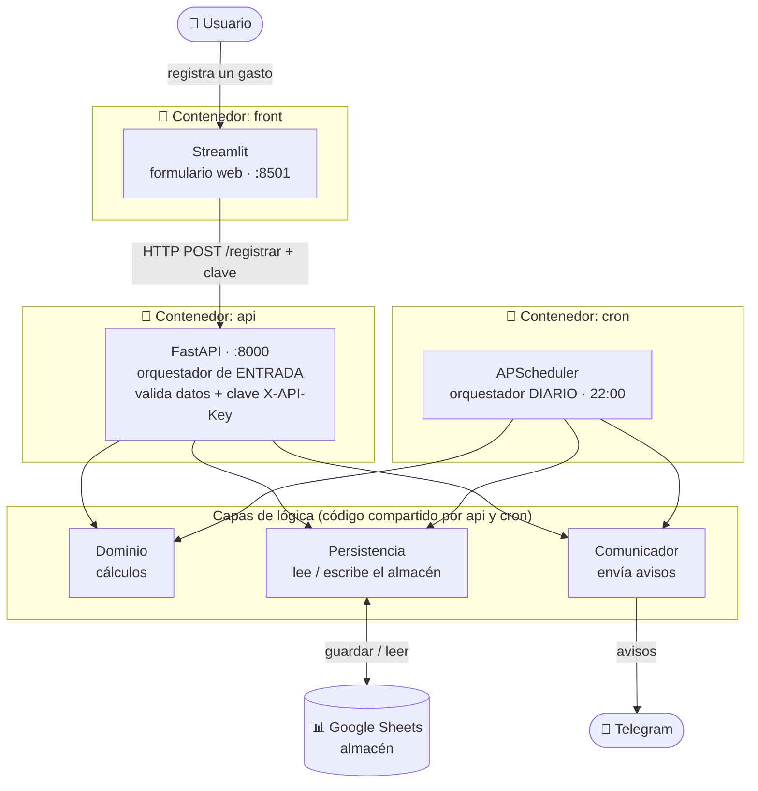

# 💸 Control de Gastos

Registro personal de gastos con **avisos automáticos**. Cada gasto que registro se guarda en
**Google Sheets**, me llega un aviso al instante por **Telegram**, y cada día recibo un **resumen
automático**. Todo empaquetado en **Docker**.

Proyecto de aprendizaje construido con **arquitectura por capas** (responsabilidad única y un
dominio que no depende de nadie). Diseñado y programado por Miguel.

---

## 🏗️ Arquitectura



> **Regla de oro:** el **Dominio** no depende de nadie. Solo la **Persistencia** toca Google Sheets;
> solo el **Comunicador** toca Telegram. Dos orquestadores (API y Cron) sobre tres obreros
> (Dominio, Persistencia, Comunicador).

---

## ⚙️ Cómo funciona

Hay **dos flujos**:

**Flujo 1 — Registrar un gasto** (lo dispara el usuario)
El usuario rellena el formulario en Streamlit → el front hace una petición HTTP a la API con la
clave de acceso → la API **valida** los datos y la clave, y **orquesta**: el Dominio modela el gasto,
la Persistencia lo guarda en Google Sheets y el Comunicador manda un aviso al instante a Telegram.

**Flujo 2 — Resumen diario** (lo dispara un reloj)
Cada día a las 22:00, el contenedor `cron` (APScheduler) dispara el resumen: la Persistencia lee
los gastos de Google Sheets, el Dominio calcula el total del día y el Comunicador envía el resumen
a Telegram.

---

## 🧱 Las piezas (arquitectura por capas)

**Obreros (hacen el trabajo):**
- **Dominio** — modela el gasto y hace los cálculos. No sabe que existen FastAPI, Sheets o Telegram.
- **Persistencia** — único que lee y escribe en el almacén (Google Sheets).
- **Comunicador** — único que habla con Telegram.

**Orquestadores (coordinan, no hacen el trabajo):**
- **API (FastAPI)** — interfaz de entrada; recibe el gasto y coordina el flujo de registro.
- **Cron (APScheduler)** — disparador diario; coordina el flujo del resumen.

---

## 🐳 Contenedores

Tres contenedores orquestados con `docker-compose`, en una red interna:

| Contenedor | Qué corre | Puerto |
|---|---|---|
| `front` | Streamlit (formulario) | 8501 |
| `api` | FastAPI (registro + auth) | 8000 |
| `cron` | APScheduler (resumen diario) | — (solo sale hacia Telegram) |

El front llama a la API **por su nombre de servicio** (`http://api:8000`) dentro de la red de Docker.
Los secretos (`.env`) y las credenciales de Google (`credenciales.json`) **no** viajan en las
imágenes: se inyectan al arrancar.

---

## 🛠️ Tecnologías

- **Python 3.14**, gestionado con **uv**
- **FastAPI** + **Uvicorn** (API REST)
- **Streamlit** (front web)
- **httpx** (cliente HTTP)
- **APScheduler** (tareas programadas)
- **gspread** (Google Sheets API)
- **Docker** + **docker-compose**
- Almacén: **Google Sheets** · Avisos: **Telegram Bot API**

---

## 📁 Estructura

```
control-gastos/
├── api/              # FastAPI: main, routers, seguridad (auth por API key)
├── dominio/          # modelo Gasto y cálculos (núcleo, sin dependencias)
├── persistencia/     # repositorio: guardar/leer en Google Sheets (gspread)
├── comunicador/      # notificador: envío a Telegram
├── reporte_diario/   # resumen + planificador (el cron diario)
├── frontend/         # app Streamlit
├── Dockerfile.api · Dockerfile.frontend · Dockerfile.cron
└── docker-compose.yml
```

---

## ▶️ Cómo ejecutarlo

**Requisitos:** Docker Desktop, un archivo `.env` y un `credenciales.json` (ambos fuera del repo):

- `.env` con: `TELEGRAM_TOKEN`, `TELEGRAM_CHAT_ID`, `API_KEY`
- `credenciales.json`: clave de una cuenta de servicio de Google con acceso (Editor) a la hoja

```bash
docker compose up --build
```

- Front: <http://localhost:8501>
- API (docs): <http://localhost:8000/docs>
